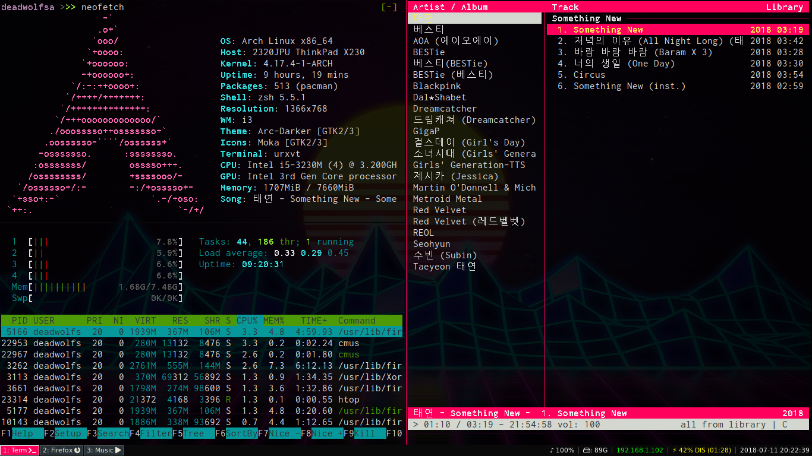

# Dot-Files

These are the dot files I use for my current Arch ricing. I'm considering switching to Void Linux and embracing the non-systemd meme. Nothing should be distro specific as I used most of this on an old Gentoo install. Enjoy having your GNU/Linux system to look as bad as mine.

Software:
--------------
**i3** - I don't use gaps because I use a thinkpad x230 and screen realestate is valuable. Only a brainlet would use gaps on a small screen.

**i3blocks**

**i3status** - Dots included but I use i3blocks.

**i3lock**

**demenu2**

**nitrogen**

**urxvt**

**cmus** - no dots yet.

**compton**

**amixer**

Hotkeys:
--------------
Vanilla i3 with Alt as the mod key

**Shift+Mod+F** for firefox

**Shift+Mod+P** for screenshot via scrot

**Shift+Mod+X** for screen lock via i3lock